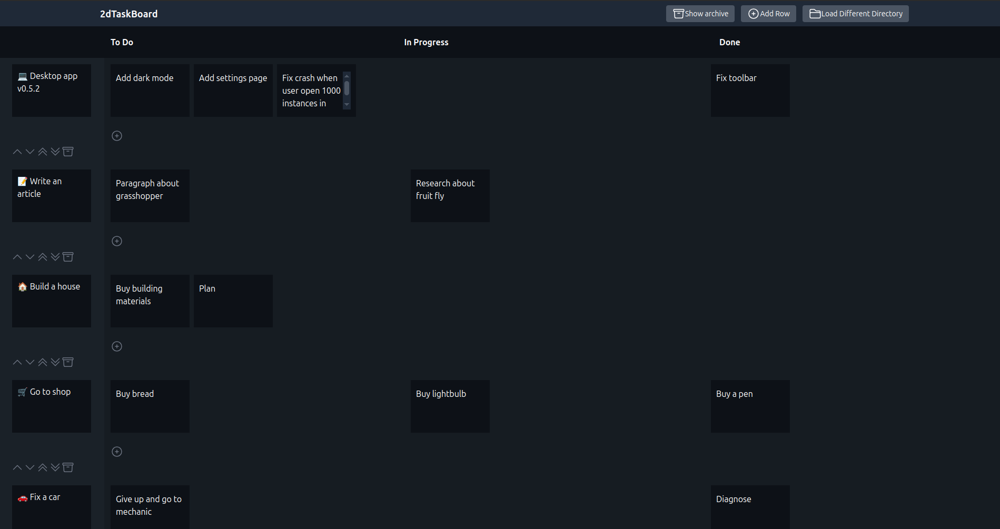
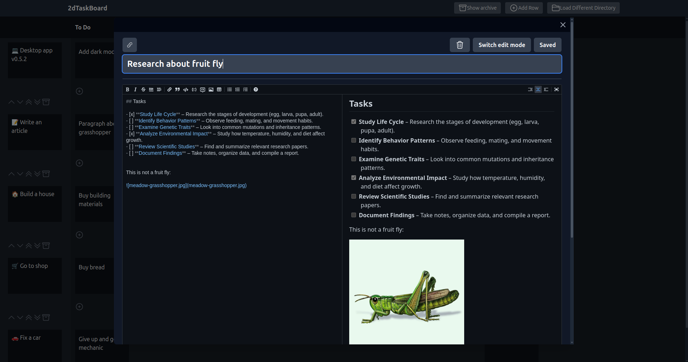

# 2dTaskBoard

Task management productivity app with markdown support.

With **2dTaskBoard** you can track the progress of your daily tasks. Key features:

- **2D Board** - move tasks between rows and columns.
- **File system based** - all your data are files which can be then synced using cloud providers or git
- **Markdown support** - rich text formatting
- **Mermaid** support - flowcharts rendering
- **Attachments** - attach files of any kind to your tasks
- **Obsidian** compatibility - open tasks in Obsidian and link to existing notes
- **Full keyboard support** - every part of this app is accessible just by pressing keyboard shortcuts

## Download

You can use it directly in a browser at https://www.piotrek-k.pl/2dTaskBoard/ or download it through "Releases" tab on GitHub.

